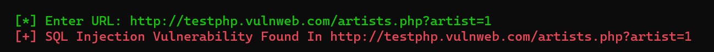

<h1><b>SQL Injection Detector In Python</b></h1>
   <a href="https://taguar258.github.io/Raven-Storm/INSTALLATION"></a>

#
<h1><b>What Is SQL Injection? </b></h1>
<h2>SQL injection is a code injection technique that might destroy your database. </h2>

#
<h1><b>What is the impact of a successful SQL injection attack?</b></h1>
<h2> There are a wide variety of SQL injection vulnerabilities, attacks, and techniques, which arise in different situations. Some common SQL injection examples include:

    💀 Retrieving hidden data, where you can modify an SQL query to return additional results.
    💀 Subverting application logic, where you can change a query to interfere with the application's logic.
    💀 UNION attacks, where you can retrieve data from different database tables.
    Examining the database, where you can extract information about the version and structure of the database.
    💀 Blind SQL injection, where the results of a query you control are not returned in the application's responses.
</h2>
<h5><a href="https://portswigger.net/web-security/sql-injection">sources</a></h5>

#
<h1><b>How and Why Is an SQL Injection Attack Performed?</b></h1>
<h2>To make an SQL Injection attack, an attacker must first find vulnerable user inputs within the web page or web application. A web page or web application that has an SQL Injection vulnerability uses such user input directly in an SQL query. The attacker can create input content. Such content is often called a malicious payload and is the key part of the attack. After the attacker sends this content, malicious SQL commands are executed in the database.

SQL is a query language that was designed to manage data stored in relational databases. You can use it to access, modify, and delete data. Many web applications and websites store all the data in SQL databases. In some cases, you can also use SQL commands to run operating system commands. Therefore, a successful SQL Injection attack can have very serious consequences.

    👽 Attackers can use SQL Injections to find the credentials of other users in the database. They can then impersonate these users. The impersonated user may be a database administrator with all database privileges.
    👽 SQL lets you select and output data from the database. An SQL Injection vulnerability could allow the attacker to gain complete access to all data in a database server.
    SQL also lets you alter data in a database and add new data. For example, in a financial application, an attacker could use SQL Injection to alter balances, void transactions, or transfer money to their account.
    👽 You can use SQL to delete records from a database, even drop tables. Even if the administrator makes database backups, deletion of data could affect application availability until the database is restored. Also, backups may not cover the most recent data.
    👽 In some database servers, you can access the operating system using the database server. This may be intentional or accidental. In such case, an attacker could use an SQL Injection as the initial vector and then attack the internal network behind a firewall.
</h2>

<h1><b>Introducing My Tool 💡</b></h1>
<h2>sqli-scanner.py is a basic sql injection finder for you. It can go through all vulnerable urls.</h2>

#
<h1><b>Give Your Close Look Here 👇</b></h1>



#
<h1><b>👾 Git Installation </b></h1>

```
# Clone My Repository
git clone 

# Change Directory
cd sqli-detector-in-python

# Execute
python sqli-detector-in-python.py
```

#
<h1><b>How To Prevent This?</b></h1>
<h2>The only sure way to prevent SQL Injection attacks is input validation and parametrized queries including prepared statements. The application code should never use the input directly. The developer must sanitize all input, not only web form inputs such as login forms. They must remove potential malicious code elements such as single quotes. It is also a good idea to turn off the visibility of database errors on your production sites. Database errors can be used with SQL Injection to gain information about your database.

If you discover an SQL Injection vulnerability, for example using an Acunetix scan, you may be unable to fix it immediately. For example, the vulnerability may be in open source code. In such cases, you can use a web application firewall to sanitize your input temporarily.</h2>
<h5><a href="https://www.acunetix.com/websitesecurity/sql-injection/">sources</a></h5>
<h2>🔴 <b>Note:</b> Now There Are Many Optional Ways To Code Backend Servers (Like Javascript Frameworks). 

